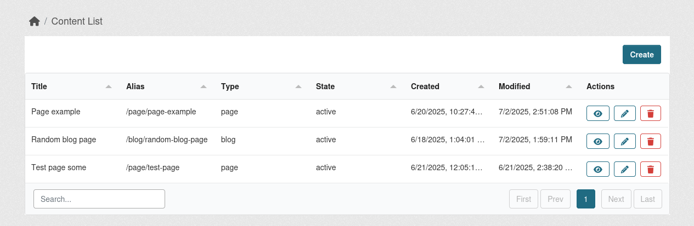

**ckanext-content** is a modern and flexible content management extension for CKAN. It replaces legacy extensions like `ckanext-pages` and `ckanext-showcase` with a schema-driven, configurable solution that supports custom content types, translations, file uploads, templating, and URL aliasing.

It is highly recommended to use it with [ckanext-scheming](https://github.com/ckan/ckanext-scheming) installed in order to increase the amount of templates, field types, validators and presets you can use to build your Content pages. Check the [Usage](https://datashades.github.io/ckanext-content/usage/#extending-the-number-field-options) section for instructions.

