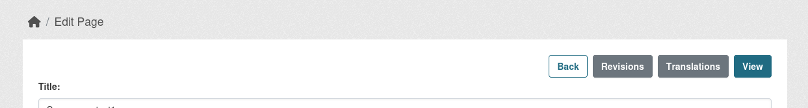
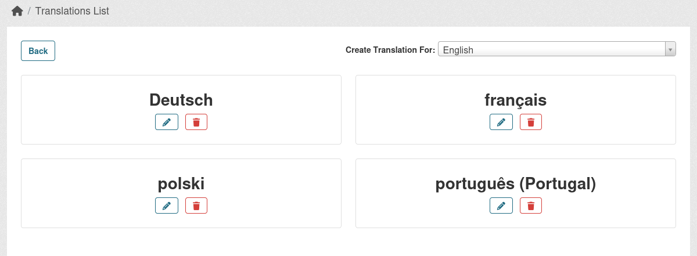
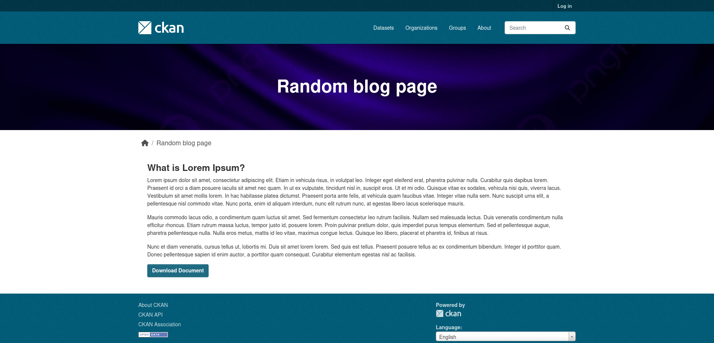
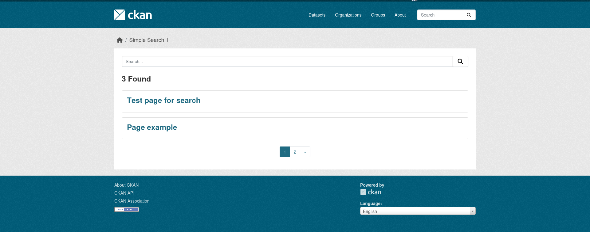

## Add Content

Navigate to `/content/list` on your portal, click `Create` and choose Content type you want to add.

Fill the fields and click `Create`.

## Register new Content types or re-define default

If you used [ckanext-scheming](https://github.com/ckan/ckanext-scheming) before, the process is quite similar to Dataset types schema register.

Create a `yaml` schema file in your custom extension (or copy the existing schemas page.yaml/blog.yaml that can be found at ckanext-content as a starting point). For example `article.yaml`.

In it specify its type and main fields. Here is a minimal schema config:

```yaml
label: Article
content_type: article

content_fields:
- field_name: title
  label: Title
  validators: not_empty unicode_safe
  form_placeholder: eg. A descriptive title
  translatable: true

- field_name: alias
  label: Alias
  validators: content_prepare_alias not_empty alias_unique is_relative_path
  required: true
  form_snippet: alias.html
  alias_prefix: /article/
  alias_source_field: title
  alias_autogenerate: true
  form_placeholder: eg. /my-article

- field_name: notes
  label: Body
  form_snippet: content_textarea.html
  display_snippet: html.html
  form_placeholder: eg. Some useful notes about the data
  form_attrs:
    data-module: ckan-content-ckeditor
  translatable: true

- field_name: state
  label: State
  preset: content_select
  choices:
    - value: 'draft'
      label: 'Draft'
    - value: 'active'
      label: 'Published'
  required: true
```

Here is a definition of each item in the schema:

**label** - Represents the human readable version of the content type.

**content_type** - Type that is going to be stored in the DB for this specific Content type.

**content_fields** - Fields that this Content type will have.

While `notes` is an optional field, all other fields are **required** to be present to make the schema work as expected.

Required fields:

**title** - Text field that represent the heading of the future Content.

**alias** - Text field that used to generate a proper URL depending of `title`.

**state** - Select where you specify whether the Content is publicly accessible or not.

You can modify those fields, add more fields. This will be described below in separate section.

Attach your newly created schema using `ckanext.content.schemas` CKAN config. By default it has 2 default types, but you can remove them if not needed or re-define using this config.

```ini
ckanext.content.schemas = 
    ckanext.content:schemas/content/page.yaml
    ckanext.content:schemas/content/blog.yaml
    ckanext.MY_EXTENSION:PATH_TO_THE_NEW_YAM_FILE/article.yaml
```

Restart CKAN and you should be able to see the new Content type in the Create options.

## Fields

There are only two required fields to be setup in order to see your field:

**field_name** - specifies the field machine name that will be stored in the DB as a key to the field value.

**label** - Ends up being the "label" for the field.

All other keys are optional and depending on what kind of field you want to see, what validation it should have, representation on form or the display output.

### Aliases

Aliases field is using additional field keys and validators specifically designed for ckanext-content.

**alias_autogenerate** - specifies if alias field will try to generate the Alias by himself using **alias_source_field** key as a reference to source field. You can set it to "False" or remove, so you will be able to setup aliases manually.

**alias_source_field** - specifies a field, where it will try to pull value and try to turn it into proper URL prepared value.

**alias_prefix** - prefix that will be attached to the generated Alias.

Validators:

**content_prepare_alias** - is used only with alias_autogenerate enabled, otherwise skips the creation process.

### Commonly used

**validators** - key where you specify how the field will be validated while create/update process. Usually validators are registered in `validators.py` or `validation.py` files.

**form_snippet** - a template that is used to display your field in a specific manner on the form, for example if its going to be just an `input` or an `textarea`. Those are usually stored under `form_snippet` folder, but you can provide additional path.

**display_snippet** - a template that is used to output the field value in different ways on your pages, its optional, so if you want to grab your data value straight in the template and display it as you want.

Out of the box, ckanext-content offers just a few fields types that you can use:

- text
- textarea
- select (using preset)
- file_upload (uploading images and files)

### Extending the number field options

It is highly recommend to add ckanext-scheming, add it to plugins list and register additional path for form_snippet, display_snippet and presets in order to have access to even bigger amount of different field types that you can create and validators. Check [ckanext-scheming](https://github.com/ckan/ckanext-scheming) for examples.

How to do it?

Install ckanext-scheming.

Add `scheming_datasets` to the plugins list.

Using `ckanext.content.presets` add the scheming default presets list to this config alongside with ckanext-content:

```ini
ckanext.content.presets =
    ckanext.content:schemas/content/presets.yaml
    ckanext.scheming:presets.json
```

Register additional path for `form_snippet` and `display_snippet`, to check in scheming extension as well:

```ini
ckanext.content.form_snippets_path =
    content/form_snippets/
    scheming/form_snippets/

ckanext.content.display_snippets_path =
    content/display_snippets/
    scheming/display_snippets/
```

Now you can use scheming validators, templates and presets.

## Translations

ckanext-content has an ability to add and store translations for your content in-house.

While visiting the Content Edit page, you can find **Translations** button, which leads to Translations list page from where you can add/update/delete Translations to your content.





By default the "create" page can be empty, because no fields are marked as `translatable`.

While adding your schema for Content type, you can specify which fields can be `translatable` by adding **translatable: true** attribute to the field. Look at schema example mentioned at **Register new Content types or re-define default** section, where Title and Notes are marked as `translatable`. You can attach this attribute to any fields and repeating fields as well.

Make sure to apply `translatable` only to fields that store text in DB.

### How it works

There is a JSONB column called `translations` attached to `content` table. While adding new or editing existing translation, it stores it under the language short name as a key and the value are the fields that being filled in the form.

Next while loading the page, the `Blueprint` that is responsible to rendering `Content`, has a logic in it to modify the original `content dict` with translated items (original version of content is still can be accessed using **original_content** variable in the template) if the language is different then the locale that is set in `ini` file.

Also there is an option to directly translate field outside of the `Content Blueprint` (e.g. tiles) by using helper:

```jinja
{{ h.content_translation_field('title', content) }}
```

To translate the whole content that is returned as per in the Blueprint, this will modify the content variable with already translated items if language is changed:

```jinja

```

## Templating (layouts)

Each Content type is using the default Jinja template to display the data, but you can register an alternative one per your custom content type.

As an example, Blog and Page default types. While Page is using default template `content.html`, Blog is using own template `content_blog.html`.

### How to register personal templates?

Create a path in your custom extension `templates` folder - `content/display`.

In this folder create a template with a name like this `content_article.html`, where `content` is the prefix and `article` is your custom content type. This will use it instead of `content.html` template that is used without the content type specific template.

Copy the content of `content.html` template into your new template and modify it as you wish.

### Working with templates

In the default template you can see that the content is called in loop, which is not something that you need for some Content types.

Example:

```jinja

    
        
    

```

You can avoid this and call your fields where needed, when needed individually:

```jinja


```

If you want to manipulate with the data on your own:

```jinja
<a class="btn btn-primary" href="{{ h.uploaded_file_url(content.data.attached_document) }}">
    {{ 'Download Document' }}
</a>
```

Or:

```jinja
{{ content.data.notes }}
```

Here is an example of default Blog template:


And modified:



The main template extends the `page.html` template in a way, where you can modify different level of the page.

## Search pages

To create a Search page for your content, you'll need to register a Blueprint as usually done in CKAN.

There is a small example of Search page that showing Pages content type tiles at `/content/search-example-1`. Its shown only to Sysadmins.



You can use this example as a starting point for your custom Search pages. The code is stored at `views/simple_search.py` -> `simple_search_1`. It already adds query ability and pagination, other filters can be added depending on your content type and requirements.
